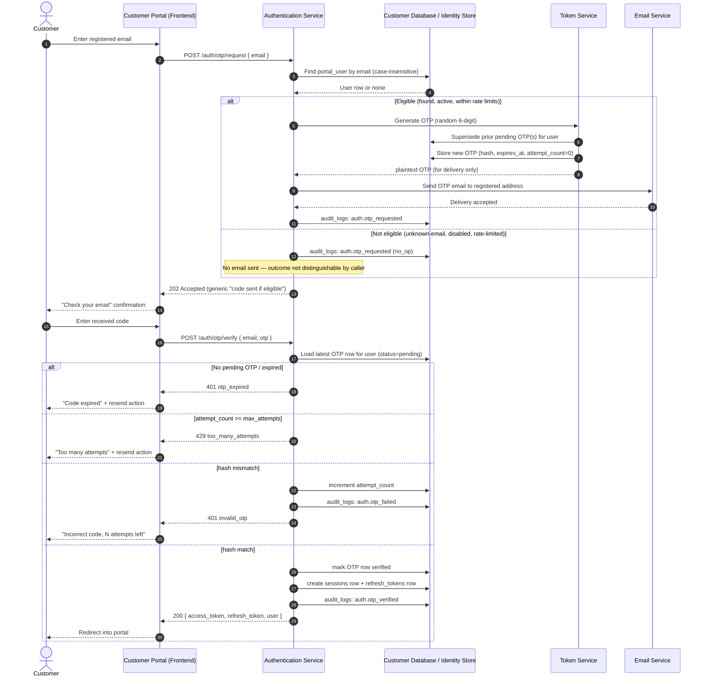

# Business Requirements & Functional Solution Analysis

## Passwordless Email-OTP Authentication for the Customer Portal

- **Status**: Implemented (additive, coexists with password/2FA/SSO login) using the recommended defaults throughout this document — [Section 15](#15-open-questions--decisions-required) is still open for business confirmation and may change these defaults. Backend: `database/migrations/0008_passwordless_otp_login.sql`, `src/repositories/otpTokenRepository.js`, `src/services/authService.js` (`requestOtpLogin`/`verifyOtpLogin`), `src/controllers/authController.js`, `src/routes/auth.routes.js`, `api/openapi.yaml`. Frontend: `frontend/src/pages/OtpLoginPage.jsx`, wired from `LoginPage.jsx` and `App.jsx` (`/otp-login`). The `0008` migration has not been applied to any database yet — run `npm run migrate` when ready.
- **Prepared as**: Business Analysis / Solution Architecture input (not an implementation ticket)
- **Date**: 2026-08-23
- **Related documents**: [`Final_Technical_Specification.md`](../../Final_Technical_Specification.md) (current auth model, section 7–9), [`customer_portal_odoo18_customer_scoped_access.md`](customer_portal_odoo18_customer_scoped_access.md) (identity/scope model this login concept must keep working with), [`cr.md`](../../cr.md) CR-006/CR-007 (existing password-reset hardening this proposal builds on)
- **Current state referenced**: `portal_users`, `sessions`, `refresh_tokens`, `identity_mappings`, `audit_logs` (`database/migrations/0001_phase1_foundation.sql`); `src/services/authService.js`, `src/controllers/authController.js`, `src/routes/auth.routes.js`

> This document treats every numeric parameter (expiry minutes, attempt counts, rate limits, session length) as a **default recommendation**, not a final decision. Every such value is called out explicitly and re-listed in [Section 15](#15-open-questions--decisions-required).

---

## Table of Contents

1. [Business Problem Statement](#1-business-problem-statement)
2. [Proposed Solution](#2-proposed-solution)
3. [End-to-End User Journey](#3-end-to-end-user-journey)
4. [Authentication Flow](#4-authentication-flow)
5. [Functional Requirements](#5-functional-requirements)
6. [Business Rules](#6-business-rules)
7. [Security Considerations](#7-security-considerations)
8. [UX/UI Requirements](#8-uxui-requirements)
9. [Exception and Edge Cases](#9-exception-and-edge-cases)
10. [Non-Functional Requirements](#10-non-functional-requirements)
11. [API / System Interaction](#11-api--system-interaction)
12. [Data Model](#12-data-model)
13. [Acceptance Criteria](#13-acceptance-criteria)
14. [Recommended Solution Architecture](#14-recommended-solution-architecture)
15. [Open Questions / Decisions Required](#15-open-questions--decisions-required)

---

## 1. Business Problem Statement

### 1.1 Current authentication model

The Customer Portal currently authenticates customers with a traditional email + permanent password credential (`portal_users.password_hash`, `src/services/authService.js#login`), optionally stacked with TOTP-based 2FA (`two_factor_enabled`/`two_factor_secret`) and a Google Workspace SSO path. Password recovery already exists as a mitigation (`POST /auth/password/forgot` → emailed reset link, CR-006/CR-007), which is itself evidence of the problem this CR addresses: the mitigation for a permanent password is a *bigger* flow than the login itself.

### 1.2 Pain points experienced by customers

- Customers log in to a B2B portal **infrequently** (to check an order, an invoice, a delivery status) — infrequent use is precisely the condition under which humans forget passwords.
- Customers often share one company inbox or a handful of named users per customer organization (see `identity_mappings`, `portal_user_companies`); credentials get written down, reused across other portals, or forgotten by the one team member who logs in.
- Password composition rules (if any) and periodic rotation add friction with no perceived benefit to a non-technical buyer/procurement user.
- Every forgotten password today already funnels through an email step (`forgotPassword` → reset link) — customers are already trained to expect "check your email to get back in." A password is the part of the flow they *don't* need.

### 1.3 Operational impact on the client

- Support tickets and admin time consumed by "I can't log in" / "reset my password for me" requests — for a B2B portal with a small number of named users per customer, this is disproportionately high relative to total login volume.
- Every forgotten-password event is also a **support-mediated identity check**: someone has to be reasonably sure they're resetting the right person's access, which is itself a security responsibility currently placed on support staff rather than the system.
- Account lockouts from repeated failed password attempts (`failed_login_attempts`, `locked_until`, `MAX_FAILED_ATTEMPTS = 5`, `LOCK_MINUTES = 15` in `authService.js`) generate additional "why am I locked out" tickets.
- Credential hygiene risk: permanent passwords sitting in browsers, spreadsheets, or shared documents at the customer's side is a security exposure the client's platform inherits but cannot directly control.

### 1.4 Why a passwordless/token-based approach solves this

- **Removes the thing customers forget.** There is no permanent secret for the customer to create, remember, rotate, or lose — only a short-lived code sent to an inbox they already control and already check as part of today's reset flow.
- **Converts "forgot password" from an exception path into the only path**, which means it gets built, tested, and hardened once, well — instead of existing as a rarely-exercised secondary flow (as it does today).
- **Shifts identity assurance to something the client already trusts**: possession of the registered email inbox. This is the same trust assumption `loginWithSso` already makes for Google-authenticated identities ("Google already proved the user controls that verified email" — `authService.js` comment) — email OTP applies the identical reasoning without requiring Google Workspace.
- **Reduces support load** by design: there is no "I forgot my password" state distinct from ordinary login — a customer who can't log in simply requests a new code, self-service, with no admin or support involvement.

---

## 2. Proposed Solution

### 2.1 Mechanism

Replace the password-entry step of login with a two-step, email-verified flow:

1. Customer submits their registered email address only (no password field).
2. The system validates eligibility (registered, active, not blocked) and — regardless of outcome, to avoid revealing which emails are registered — responds with a generic "if this email is registered, a code has been sent" acknowledgement.
3. If eligible, a short-lived, single-use, random numeric code (the OTP) is generated, hashed, and stored server-side; the *plaintext* code is emailed to the customer.
4. Customer enters the code in the portal; the system validates it against the stored hash, checks expiry/attempt count, and — if valid — issues a session exactly the way `issueSession()` does today for password and SSO logins (same `access_token` / `refresh_token` pair, same `sessions`/`refresh_tokens` rows).

This is deliberately **the same session/credential layer the portal already has** — only the *first factor* changes, from "something you know" (password) to "something you have access to" (the registered inbox), verified via a time-boxed code instead of a static secret.

### 2.2 Why this removes the need for a permanent password

A permanent password is a long-lived secret the customer must originate and protect. An OTP is generated by the system, lives for minutes, and is meaningless the moment it's used or expires. Nothing durable is stored on the customer's side at all — there is no artifact to forget, reuse across sites, or leak from a spreadsheet. The "forgot password" problem is eliminated because there is no password to forget; every login is, structurally, what "forgot password" used to be.

### 2.3 Customer experience improvement

- One input field to start (email), matching the mental model of consumer platforms customers already use (Udemy, Slack magic-link/OTP, many banking OTP flows).
- No account-creation friction around password composition rules.
- Recovery and normal login become **the same flow** — there is no separate, worse path when a customer can't remember something.

### 2.4 Support impact

- Eliminates the entire "reset my password" support category for customers on this flow.
- Remaining support cases narrow to genuinely operational issues (registered email inbox no longer accessible, account disabled by an admin) — both of which require human judgment today anyway and are not made worse by this change.

### 2.5 Relationship to the existing password / 2FA / SSO paths

This CR does **not** assume password login, TOTP 2FA, or Google SSO are deleted on day one — that is a rollout decision for the business (see [Section 15](#15-open-questions--decisions-required)). The recommended design is additive and coexists cleanly with the current schema and services:

- `issueSession()` in `authService.js` is reused unchanged — OTP verification is simply a new way to reach the same session-issuance code path that `login()`, `loginWithSso()`, and 2FA verification already call.
- `portal_users.password_hash` can remain populated for existing accounts during a transition period; new/OTP-only accounts would need it to become nullable (schema change, not a data change — flagged in [Section 12](#12-data-model)).
- Platform admin accounts (`is_platform_admin = true`) are **out of scope** for this CR's business driver (they are internal operators, not the B2B customers experiencing the pain in Section 1) — recommend they keep password + 2FA unless the business decides otherwise ([Section 15](#15-open-questions--decisions-required)).

---

## 3. End-to-End User Journey

| # | Step | Customer experience | System behavior |
|---|---|---|---|
| 1 | Open Customer Portal | Sees a single email field, no password field | Frontend renders the OTP login screen (no password UI at all) |
| 2 | Enter email address | Types registered email, submits | Frontend calls `POST /auth/otp/request` |
| 3 | Request token | Sees a "Check your email" confirmation immediately | Backend validates eligibility silently; generates + stores hashed OTP; invalidates any prior pending OTP for this account; sends email — **response is identical whether or not the email is registered** |
| 4 | Receive email | Gets an email with a 6-digit code and the expiry window stated in the copy | Email Service delivers via existing `emailService.send()` |
| 5 | Enter token | Types the 6-digit code into the portal | Frontend calls `POST /auth/otp/verify` |
| 6 | Successful authentication | Redirected into the portal, already on their default/last company context | Backend validates the code, issues `access_token` + `refresh_token` via `issueSession()`, records `audit_logs` entry |
| 7 | Token expired | Sees "This code has expired" with a one-tap "Send a new code" action | Verify request rejected (`401 otp_expired`); no session issued |
| 8 | Invalid token | Sees "That code isn't right" with attempts remaining, no lockout yet | Verify rejected (`401 invalid_otp`); `attempt_count` incremented |
| 9 | Resend token | Taps "Resend code"; sees confirmation again, previous code shown as no longer valid in copy | Backend requires cooldown to have elapsed, else returns a "please wait Ns" response; on success, prior pending OTP is superseded |
| 10 | Logout | Taps logout, returned to the email-entry screen | `POST /auth/logout` — unchanged, revokes `sessions` row + `refresh_tokens` |
| 11 | Subsequent login | Same single-field flow every time — nothing to remember between visits | Identical to steps 1–6; no state carried over from prior sessions except the registered email itself |

---

## 4. Authentication Flow

### 4.1 Step-by-step

1. **Frontend** collects the email address only and calls `POST /auth/otp/request`.
2. **Authentication Service** normalizes the email (case-insensitive, matching the existing `ux_portal_users_email` index) and asks the **Customer Database** whether a `portal_users` row exists.
3. Regardless of the lookup result, the Authentication Service will *appear* to succeed to the caller (HTTP 202, generic body) — this mirrors the enumeration-safe pattern `forgotPassword()` already implements today.
4. If the account exists **and** is eligible (`status = 'active'`, not rate-limited), the Authentication Service asks the **Token Service** to mint a new OTP: a cryptographically random 6-digit code, hashed (SHA-256, same primitive `crypto.sha256()` already used for refresh tokens) before storage — the plaintext code is never persisted.
5. Any previously pending OTP for that account/purpose is marked `superseded` in the same transaction — only the newest code is ever valid.
6. The Token Service (logically; can be a module inside the Authentication Service, see [Section 14](#14-recommended-solution-architecture)) hands the plaintext code to the **Email Service**, which sends it to the customer's registered address, and returns.
7. **Customer** retrieves the code from their inbox and submits it via `POST /auth/otp/verify` together with the email.
8. **Authentication Service** loads the latest non-terminal OTP row for that account, checks `expires_at`, checks `attempt_count < max_attempts`, and compares the hash of the submitted code to the stored `token_hash`.
9. On match: mark the OTP row `verified`, call the existing `issueSession()` (creates a `sessions` row + `refresh_tokens` row exactly as password/SSO login do), return `access_token`/`refresh_token`/`user` to the frontend, write an `audit_logs` entry (`auth.otp_verified`).
10. On mismatch: increment `attempt_count`; if the new count reaches the configured maximum, mark the OTP row `locked` (or `expired`) so no further guesses are possible against it, and require a resend; write an `audit_logs` entry (`auth.otp_failed`) either way.
11. On expiry: reject with a distinct client-facing state (`otp_expired`) that drives the frontend straight to a resend affordance.

### 4.2 Sequence diagram



---

## 5. Functional Requirements

| ID | Requirement Name | Description | Business Rule | Priority | Acceptance Criteria (summary) |
|---|---|---|---|---|---|
| FR-01 | Email validation | System validates the submitted address is well-formed before any lookup | Reject malformed input client- and server-side before touching the database | Must | Malformed email → `400 bad_request`, no DB query issued |
| FR-02 | Customer identification | System resolves the email to a `portal_users` record, case-insensitively | Matches existing `ux_portal_users_email` uniqueness rule | Must | `Test@x.com` and `test@x.com` resolve to the same account |
| FR-03 | Token generation | System generates a random, time-limited OTP on each eligible request | See [Section 6](#6-business-rules) for length/format/expiry defaults | Must | Two consecutive requests never produce the same code |
| FR-04 | Token delivery | System emails the plaintext OTP to the registered address only | Never returned in the API response in production | Must | Response body never contains the OTP outside non-production debug mode (mirrors CR-006 pattern) |
| FR-05 | Token expiration | Each OTP is valid only until its `expires_at` | Default 10 minutes, configurable | Must | Verify after expiry → `401 otp_expired` even with the correct code |
| FR-06 | Token validation | System validates submitted code against the stored hash for the current pending token only | Comparison against hash, never plaintext-to-plaintext | Must | Correct code + not expired + attempts remaining → session issued |
| FR-07 | Invalid token handling | Incorrect code increments an attempt counter without revealing the correct value or reason | Generic error message on every rejection reason except expiry | Must | 3 wrong guesses in a row → counter = 3, no lockout yet at default threshold |
| FR-08 | Token resend | Customer can request a new OTP, which invalidates the previous one | Cooldown enforced between requests (see Section 6) | Must | Old code stops working the instant a new one is requested |
| FR-09 | Maximum verification attempts | After N failed attempts on one OTP, that OTP is locked and cannot be retried even with the correct code | Default N = 5, configurable | Must | 5th wrong guess locks the token; a subsequent correct-code submission against the same token still fails |
| FR-10 | Maximum request rate | Limits how many OTPs can be requested per account within a rolling window | Default 3 requests / 15 minutes, configurable | Must | 4th request within the window is rejected/deferred, not silently ignored |
| FR-11 | Account eligibility validation | Only `active` accounts can receive/verify OTPs | `pending_verification` and `disabled` handled per Section 6 | Must | Disabled account → generic "sent" response, no email actually sent |
| FR-12 | Session creation | Successful verification issues the same session/refresh-token pair as password/SSO login | Reuses `issueSession()` — no parallel session model | Must | OTP-issued session is indistinguishable in shape from a password-issued one |
| FR-13 | Logout | Existing logout endpoint revokes the session and its refresh token | No change to current behavior | Must | `POST /auth/logout` still works unmodified |
| FR-14 | Session timeout | Access token and refresh token expire on the existing schedule | Reuses `ACCESS_TOKEN_TTL` / `REFRESH_TOKEN_TTL_DAYS` | Must | No new session-lifetime concept introduced |
| FR-15 | Error handling | All rejection paths return typed API errors, never raw stack traces or DB errors | Consistent with existing `ApiError` pattern | Must | Every failure branch maps to a documented HTTP status + code |
| FR-16 | Audit logging | Every request, success, and failure is recorded in `audit_logs` | Actions: `auth.otp_requested`, `auth.otp_verified`, `auth.otp_failed`, `auth.otp_locked` | Must | Security review can reconstruct any login attempt from audit data alone |
| FR-17 | Session/auth status endpoint | Frontend can check whether the current access token still represents a valid session | New — not currently exposed under `/auth/*` | Should | `GET /auth/session` returns `200` with user info or `401` |
| FR-18 | Non-disclosure of account state | Request/verify responses never let a caller distinguish "unregistered email" from "registered but ineligible" | Extends the pattern already used by `forgotPassword()` | Must | Timing and response shape are equivalent for both cases within a reasonable tolerance |

---

## 6. Business Rules

All numeric values below are **recommended defaults**, presented for business confirmation, not final. The "Configurable?" column marks parameters that should be environment/config-driven (matching how `ACCESS_TOKEN_TTL`, `REFRESH_TOKEN_TTL_DAYS` already work in `src/config/env.js`) rather than hard-coded.

| Rule | Recommended default | Configurable? | Rationale |
|---|---|---|---|
| OTP length & format | 6-digit numeric | Yes | Matches the CR's own reference model (Udemy-style); numeric is faster to type on mobile than alphanumeric — see [Section 15](#15-open-questions--decisions-required) for the alphanumeric alternative |
| OTP validity period | 10 minutes | Yes | Within the CR's suggested 5–15 minute range; long enough to switch to a mail client, short enough to bound exposure |
| OTP single-use | Enforced (hard rule, not configurable) | No | A used OTP transitions to a terminal `verified` status and can never be replayed |
| New OTP invalidates prior OTP(s) | Enforced (hard rule) | No | Every `/otp/request` supersedes any still-pending OTP for that account, closing the "customer has two valid codes at once" ambiguity |
| Max verification attempts per OTP | 5 | Yes | Bounds brute-force guessing against a 6-digit (1,000,000-value) space within the token's own lifetime |
| Max OTP requests per rolling window | 3 requests / 15 minutes per account | Yes | Prevents inbox spamming and abuse of email-sending cost/reputation |
| Minimum cooldown between requests | 30–60 seconds | Yes | Prevents a customer (or an attacker) from immediately invalidating a just-sent code by requesting another |
| Session/token lifetime | Existing `ACCESS_TOKEN_TTL` (15m) / `REFRESH_TOKEN_TTL_DAYS` (30d) | Yes (already is) | No new session model — OTP is a login *method*, not a new session lifecycle |
| Customer account eligibility | `status = 'active'` only | Business to confirm for `pending_verification` | See row below — recommend `pending_verification` blocked from OTP login until a decision is made on whether OTP can double as activation |
| Inactive / not-yet-activated (`pending_verification`) accounts | Rejected with the same generic response as an unregistered email | Business to confirm | Avoids conflating "hasn't finished onboarding" with "doesn't have a code" in a way that leaks account existence |
| Blocked / disabled accounts | Rejected with the same generic response as an unregistered email; no email sent | No (matches CR-007 precedent for password reset) | An admin disabling an account must actually revoke access, not just add friction |
| Re-check of account status at verification time | Enforced | No | Closes the same race CR-007 closed for `resetPassword`/`verifyTwoFactor`: an admin can disable an account in the window between OTP request and verification |

---

## 7. Security Considerations

| Concern | Analysis | Mitigation |
|---|---|---|
| Token randomness / entropy | A 6-digit numeric OTP has 10⁶ possible values — materially lower entropy than the 48-byte refresh tokens already used elsewhere in this system | Compensate with short expiry (10 min), low attempt ceiling (5), and rate-limited requests — entropy is deliberately traded for usability and must be offset procedurally, not left as a bare 1-in-1,000,000 guess space |
| Token expiration | Unbounded validity would widen the attack window indefinitely | Hard `expires_at` check on every verify, re-validated server-side (never trust client-reported time) |
| Single-use enforcement | Replay of a captured/observed code | OTP row transitions to a terminal status on first successful verification; verification against a terminal-status row always fails |
| Brute-force protection | 6-digit space is guessable within attempt budgets if unbounded | Attempt counter per OTP + lockout at threshold; counter is server-side and cannot be reset by the client |
| Rate limiting | Attacker enumerating emails or exhausting email-sending budget | Per-account request throttling (Section 6); recommend also rate-limiting `/otp/request` by source IP as a defense-in-depth layer (`ip_address` already captured on `sessions`, so the plumbing to capture IP exists) |
| Email security dependency | The entire first factor now depends on the security of the customer's email account and the mail transport in between | Explicitly out of the platform's control — must be documented as an accepted dependency; recommend the business decide whether higher-risk actions (see [Section 15](#15-open-questions--decisions-required)) should require a second factor on top of email-OTP |
| Customer enumeration prevention | A naive implementation could reveal registered emails via response differences (status code, timing, wording) between "registered" and "not registered" | Uniform `202`-style response body and status for all outcomes of `/otp/request`, matching the existing `forgotPassword()` pattern; avoid short-circuiting the eligible branch (e.g. skip the email-send call but keep comparable latency) |
| Session management | Same session/refresh-token model already in production | No new surface introduced — session revocation, rotation (`refreshTokenRepository.rotate`), and logout are unchanged |
| HTTPS/TLS | OTP travels over the API call and over email transport | Enforce TLS for all `/auth/*` traffic (already assumed platform-wide); email transport TLS (STARTTLS/MTA-STS) is a mail-provider configuration concern to confirm with whichever provider is selected ([Section 15](#15-open-questions--decisions-required)) |
| Secure token storage | Storing OTPs in plaintext would make the database a single point of full compromise for all pending logins | Store only `sha256(otp)`, matching the existing `refresh_tokens.token_hash` pattern — never persist the plaintext code |
| Audit logging | Need forensic trail for disputed/suspicious logins | Every request/success/failure writes to `audit_logs` with actor, action, IP, user agent, timestamp (schema already supports this) |
| Suspicious login detection | New device/location logging in with a valid OTP is still a legitimate flow (unlike a stolen password, a stolen OTP requires inbox access) | Recommend at minimum notifying the customer by email on successful login from a new IP/device as a detective control; full anomaly detection is a candidate for a later phase, not this CR |
| Logout & session invalidation | Must fully revoke access, not just the current OTP | Unchanged from today: `logout()` revokes the `sessions` row and cascades to `refresh_tokens` |

### 7.1 Notable residual risks

- **Compromised email account = compromised portal access.** This is the fundamental trade this CR makes and must be stated plainly to the business, not hidden in an appendix.
- **6-digit OTP is inherently lower-entropy than a strong password + working 2FA.** The mitigations above manage this risk down but do not eliminate it; if the customer's data sensitivity is high, stacking a second factor is worth revisiting ([Section 15](#15-open-questions--decisions-required)).

---

## 8. UX/UI Requirements

| Screen / State | Message (example copy) | Notes |
|---|---|---|
| Login screen | "Enter your email to get a login code." Single email field, no password field anywhere in the DOM. | Removing the password field entirely (not just hiding it) avoids autofill/password-manager confusion |
| Email submitted / "code sent" confirmation | "If [email] is registered, we've sent a login code. It's valid for 10 minutes." | Wording is deliberately non-committal about registration status — this is a security requirement (FR-18), not just copywriting |
| Token entry screen | 6-box or single numeric input, "Enter the 6-digit code we emailed you", plus a visible countdown or "expires at HH:MM" | Auto-advance/auto-submit on 6th digit recommended for mobile UX |
| Invalid token | "That code isn't right. N attempts remaining." | Never state *why* it's wrong (expired vs mistyped vs already used) beyond the distinct expired-state message below — avoids helping an attacker calibrate |
| Expired token | "This code has expired. Send a new one?" with a prominent resend button | Distinct from "invalid" so a legitimate customer isn't left guessing whether to keep trying |
| Resend token | "New code sent to [email]." If cooldown active: "Please wait Ns before requesting another code." | Cooldown countdown should be visible so the customer doesn't perceive the button as broken |
| Too many attempts | "Too many incorrect attempts. Please request a new code." — verify form disabled, resend action offered | This is the recovery path from FR-09's lockout, not a dead end |
| Customer not eligible (disabled/unregistered) | Same as "code sent" confirmation above | Intentionally identical UI state — the non-disclosure requirement is a UX requirement, not only a backend one |
| Successful login | Immediate redirect into the portal (dashboard / last-visited page), optional one-time toast: "Logged in as [name]" | No further confirmation screen — minimize steps between code entry and being productive |

General UX principles: no jargon ("OTP", "token", "hash") in customer-facing copy — use "code"; every error state offers a next action (resend, wait, contact support) rather than a dead end; the flow must be fully usable on mobile (numeric keypad auto-invoked for the code field).

---

## 9. Exception and Edge Cases

| Case | Expected system behavior |
|---|---|
| Unregistered email submitted | Generic "code sent if eligible" response; no email sent; `audit_logs` records the attempt without exposing it to the caller |
| Incorrect token entered | `attempt_count` incremented; generic "incorrect code" response with remaining-attempts count; no session issued |
| Token expires before verification | `401 otp_expired`; verification fails even if the code is otherwise correct; customer directed to resend |
| Multiple token requests in succession | Each new request supersedes the prior pending token; cooldown (Section 6) throttles rapid-fire requests |
| Customer receives an older token after requesting a new one (delayed email delivery) | The older token in the customer's inbox is already `superseded` server-side and will be rejected at verify time even though it "looks" like a valid unused code to the customer — UX copy on the entry screen should note "use the most recent code" to reduce confusion |
| Email delivery delayed | Customer can request a new code once the cooldown elapses; system does not know about mail-transport delay and should not assume the first email was lost — hence the cooldown, not an immediate unlimited resend |
| Email never received (spam filter, wrong inbox rules, provider outage) | Customer can keep resending within the rate limit; beyond the rate limit, this becomes a support case (mail deliverability), not an authentication bug — recommend a visible "not receiving codes?" help link |
| Customer requests a token many times in a short period | Rate limit (Section 6) engages; recommend the rejection response still be non-committal about *why* to avoid confirming account existence via a different response shape |
| Customer account is inactive (`pending_verification`) | Treated as ineligible — see open decision in Section 6/15 on whether this should instead trigger/complete activation |
| Customer account is blocked (`disabled`) | Treated identically to an unregistered email at every step (request and verify) |
| Customer opens multiple browser sessions/tabs | Each tab can independently request and verify its own OTP; requesting a new OTP in one tab invalidates a pending one from another tab — acceptable, since only one login attempt can be "in flight" at a time by design |
| Customer uses the same token in multiple sessions/tabs | First successful verification marks the token `verified` (terminal); any subsequent verify attempt with that same code fails, in any tab/session |
| Brute-force token guessing | Bounded by max-attempts-per-token (FR-09) and max-requests-per-window (FR-10); both counters are server-side state, immune to client manipulation |
| Clock skew between OTP creation and verification | `expires_at` is computed and checked server-side only; client clocks are never trusted for expiry decisions |
| Customer changes their registered email between request and verify (e.g. admin edits the record) | Recommend binding the pending OTP to the `portal_user_id`, not just the email string at request time, so an in-flight OTP survives an unrelated profile edit but a *different* account cannot inherit it |

---

## 10. Non-Functional Requirements

| Category | Requirement |
|---|---|
| Security | OTP hashes at rest only; TLS in transit for API and (where controllable) email; audit trail for every auth event; no plaintext OTP ever logged (including application logs) |
| Performance | `/auth/otp/request` and `/auth/otp/verify` should respond within existing API latency targets for `/auth/*` (recommend aligning to current `login()` p95, since this replaces it); email delivery latency is external and should be monitored separately from API latency |
| Availability | Auth flow availability depends on the email provider being reachable — recommend a documented fallback/support process for provider outages (this is a business continuity decision, not purely technical) |
| Scalability | Rate-limit counters and OTP lookups must be indexed for the expected login volume (see [Section 12](#12-data-model) index recommendations); no architectural blocker to scaling beyond what `sessions`/`refresh_tokens` already handle |
| Reliability | Superseding/locking logic must be transactional (supersede-old + insert-new in one DB transaction) to avoid a race where two valid OTPs exist simultaneously |
| Auditability | Every request/verify/lock event recorded in `audit_logs` with enough metadata to reconstruct a disputed login without needing mail-server logs |
| Maintainability | OTP issuance/verification reuses existing `issueSession()`, `sessionRepository`, `refreshTokenRepository`, `emailService`, and `ApiError` conventions rather than introducing parallel mechanisms |
| Usability | Single-field entry, mobile-friendly numeric input, non-dead-end error states (Section 8) |
| Monitoring & alerting | Recommend dashboards/alerts on: OTP request volume anomalies (possible enumeration/abuse), email delivery failure rate, verification failure rate, lockout rate — these are leading indicators of both abuse and mail-deliverability problems |

---

## 11. API / System Interaction

All endpoints live under the existing `/auth` router (`src/routes/auth.routes.js`) alongside `login`, `logout`, `refresh`, `2fa/*`, `password/*`, and `sso/*`. No changes to the existing endpoints are required by this CR beyond what's noted in [Section 2.5](#25-relationship-to-the-existing-password--2fa--sso-paths).

### 11.1 `POST /auth/otp/request`

| | |
|---|---|
| Purpose | Request a login OTP for a given email |
| Request body | `{ "email": "string" }` |
| Response (always, on well-formed input) | `202 Accepted`, empty body (or `{ "debug_otp": "..." }` only in non-production without SMTP configured, mirroring the CR-006 `debug_reset_token` pattern) |
| Error scenarios | `400 bad_request` — malformed email only. **Implemented**: cooldown/window-exceeded is silently absorbed into the same `202` (resolves Section 15 question #6 toward the safer, non-disclosing default) rather than a distinct `429` |
| Notes | Never returns a different status/body for "unregistered" vs "registered" vs "disabled" — see FR-18 |

### 11.2 `POST /auth/otp/verify`

| | |
|---|---|
| Purpose | Verify a submitted OTP and, if valid, log the customer in |
| Request body | `{ "email": "string", "otp": "string" }` |
| Response (success) | `200 OK`, `{ "access_token": "...", "refresh_token": "...", "user": { ... } }` — identical shape to `login()`'s success response |
| Error scenarios | `401 invalid_otp` — wrong code, unregistered email, or account disabled (collapsed into one generic error — see below); `401 otp_expired` — expired or no pending OTP; `429 too_many_attempts` — attempt ceiling reached |
| **Implementation note** | Account status is re-checked immediately before session issuance (closing the same race CR-007 closed for `resetPassword`/`verifyTwoFactor`), but the rejection reuses `401 invalid_otp` rather than a distinct `423 account_disabled` — a separate status here would let a caller distinguish "wrong code" from "this account got disabled after the code was sent," which is exactly the disclosure FR-18 rules out. |
| Notes | Reuses `issueSession()`; writes `audit_logs` on every outcome |

### 11.3 `POST /auth/otp/resend`

| | |
|---|---|
| Purpose | Explicit "resend code" action from the UI |
| Request body | `{ "email": "string" }` |
| Response | Same contract as `/auth/otp/request` |
| Error scenarios | `429 rate_limited` — cooldown not yet elapsed |
| Notes | Can be implemented as a thin alias of `/otp/request` sharing the same service function — listed separately here because the CR calls for a distinct UX affordance, not necessarily distinct backend logic |

### 11.4 `GET /auth/session`

| | |
|---|---|
| Purpose | Let the frontend check whether the current access token still represents a valid, active session (new endpoint — not present today) |
| Request | Bearer access token |
| Response (valid) | `200 OK`, `{ "authenticated": true, "user": { ... } }` |
| Error scenarios | `401 unauthenticated` — missing/expired/invalid access token |
| Notes | Useful for the SPA to silently verify session state on load, independent of the OTP flow itself |

### 11.5 `POST /auth/logout`

Unchanged — already implemented (`authController.logout` → `authService.logout`), revokes the session and its refresh token.

---

## 12. Data Model

### 12.1 New: `otp_tokens`

| Column | Type | Notes |
|---|---|---|
| `id` | UUID PK | |
| `portal_user_id` | UUID, FK → `portal_users(id)` | Bound to the account, not the raw email string (see edge case in Section 9) |
| `purpose` | VARCHAR(20), default `'login'` | Kept extensible for future non-login OTP uses without a new table |
| `token_hash` | TEXT | `sha256(otp)`, reusing `crypto.sha256()` — **plaintext OTP is never stored** |
| `status` | VARCHAR(20) | `pending` \| `verified` \| `expired` \| `superseded` \| `locked` |
| `attempt_count` | SMALLINT, default 0 | Incremented on each failed verify against this row |
| `expires_at` | TIMESTAMPTZ | Server-computed at creation; never client-supplied |
| `verified_at` | TIMESTAMPTZ, nullable | Set on successful verification |
| `requested_ip` | INET, nullable | For rate-limiting and audit correlation |
| `requested_user_agent` | TEXT, nullable | Audit correlation |
| `created_at` | TIMESTAMPTZ, default `now()` | |

Recommended indexes: `(portal_user_id, status)` for "find current pending OTP" lookups and for rate-limit window counting (`created_at` range scan per user).

### 12.2 Modified: `portal_users`

- `password_hash` — recommend relaxing from `NOT NULL` to nullable if/when OTP-only accounts are supported; existing rows are unaffected until the business decides whether existing passwords are retired ([Section 15](#15-open-questions--decisions-required)).
- No other structural changes required — `status`, `is_platform_admin`, `two_factor_enabled`/`two_factor_secret` all remain meaningful and are reused as-is by this design.

### 12.3 Reused, unchanged

- `sessions`, `refresh_tokens` — OTP-issued sessions are ordinary rows in these tables, created via the existing `issueSession()`.
- `identity_mappings`, `portal_user_companies` — unaffected; company context resolution after login is unchanged.
- `audit_logs` — reused with new `action` values: `auth.otp_requested`, `auth.otp_verified`, `auth.otp_failed`, `auth.otp_locked`.

### 12.4 What must never be stored in plaintext

- The OTP itself — only its SHA-256 hash.
- Nothing else in this design introduces a new plaintext-secret storage requirement (session tokens are already handled via the existing hashed `refresh_tokens` pattern).

---

## 13. Acceptance Criteria

**AC-01 — Successful login**
Given a registered, active customer with email `customer@example.com`
When they request an OTP and submit the correct, unexpired code within the attempt limit
Then they receive a valid `access_token`/`refresh_token` pair and are redirected into the portal.

**AC-02 — Invalid token**
Given a customer with a pending, unexpired OTP
When they submit an incorrect code
Then the system returns `401 invalid_otp`, increments the attempt counter, and issues no session.

**AC-03 — Expired token**
Given a customer whose OTP was issued more than the configured validity period ago
When they submit that code, even if it is otherwise correct
Then the system returns `401 otp_expired` and issues no session.

**AC-04 — Resend token**
Given a customer with a pending OTP and an elapsed cooldown period
When they request a new code
Then the prior OTP is marked `superseded`, a new OTP is generated and emailed, and only the new code can succeed at verification.

**AC-05 — Maximum attempts exceeded**
Given a customer who has submitted incorrect codes up to the configured attempt ceiling
When they submit another code against that same OTP, correct or not
Then the system returns `429 too_many_attempts` and issues no session, requiring a resend to proceed.

**AC-06 — Inactive customer**
Given a customer account with status `pending_verification` or `disabled`
When they request or attempt to verify an OTP
Then the system responds identically to the unregistered-email case at every step, and no session is ever issued.

**AC-07 — Unregistered email**
Given an email address with no matching `portal_users` record
When a customer requests an OTP for it
Then the system responds with the same generic acknowledgement used for eligible accounts, and no email is sent.

**AC-08 — Token reuse**
Given an OTP that has already been successfully verified
When it is submitted again, in the same or a different session/tab
Then the system rejects it as invalid, regardless of correctness of the code value.

**AC-09 — Logout**
Given a customer with an active OTP-issued session
When they log out
Then their session and refresh token are revoked and subsequent API calls with the old access token are rejected once it expires or is checked against the revoked session.

---

## 14. Recommended Solution Architecture

```
Customer
   │  (email only)
   ▼
Customer Portal (Frontend / SPA)
   │  POST /auth/otp/request, POST /auth/otp/verify
   ▼
Authentication Service   ── issueSession() ──►  Sessions / Refresh Tokens (existing)
   │        │
   │        └─────────────► Token Service (OTP generation, hashing, expiry, attempt/rate policy)
   │                                │
   │                                ▼
   │                        Customer Database / Identity Store
   │                        (portal_users, otp_tokens, audit_logs)
   ▼
Email Service (existing emailService.send()) ──► Customer's registered inbox
```

**Component responsibilities:**

- **Customer Portal (Frontend)** — collects email and code, renders the states in [Section 8](#8-uxui-requirements), holds no credential state beyond the session tokens it already manages today.
- **Authentication Service** — orchestrates eligibility checks, delegates OTP lifecycle to the Token Service, and is the only component that calls `issueSession()`. This is the natural home for the new logic inside the existing `src/services/authService.js` (or a sibling `otpService.js` it composes with), keeping one auth surface rather than a parallel one.
- **Customer Database / Identity Store** — the existing Postgres schema (`portal_users` + new `otp_tokens`); no new datastore introduced.
- **Token Service** — a logical responsibility (generation, hashing, supersession, attempt/rate accounting), not necessarily a separate network service; can be a plain module reusing `crypto.sha256()`/`crypto.randomBytes()`-based generation, matching how `refresh_tokens` are already produced.
- **Email Service** — the existing `emailService.send()` used today by `forgotPassword()`; no new provider integration required, only a new email template.

**Migration/coexistence strategy:** ship OTP login as an additional entry point first (password/2FA/SSO untouched), measure adoption and support-ticket impact, then let the business decide the deprecation timeline for password login per [Section 15](#15-open-questions--decisions-required). This avoids a hard cutover risk on a live customer-facing system.

---

## 15. Open Questions / Decisions Required

These require explicit business sign-off before implementation — none should be assumed:

1. **Token format** — numeric OTP (recommended, faster mobile entry) vs. alphanumeric token (larger entropy, slower to type). Which does the business prefer, and for which risk tier of customer?
2. **Token length** — 6 digits recommended; confirm, especially against any existing brand/UX convention the client uses elsewhere.
3. **Token expiration duration** — 10 minutes recommended within the CR's stated 5–15 minute range; confirm.
4. **Email-only authentication vs. additional factors** — should any actions (e.g. changing the registered email, high-value order actions) require a second factor stacked on top of the OTP? Should TOTP 2FA remain available/required for any customer segment?
5. **Maximum verification attempts** — 5 recommended; confirm, and confirm whether the account should also lock (not just the single OTP) after repeated OTP failures across multiple requests.
6. **Rate-limiting policy** — 3 requests / 15 minutes + 30–60s cooldown recommended; confirm thresholds, and confirm whether rate-limit rejections should be silently absorbed into the generic "sent" response (safer against enumeration) or surfaced distinctly (better UX, slightly more information leaked).
7. **Session duration** — confirm whether OTP-issued sessions should keep the current `ACCESS_TOKEN_TTL`/`REFRESH_TOKEN_TTL_DAYS` or warrant different values now that login itself is cheaper to repeat.
8. **Customer account lifecycle** — should a `pending_verification` account be able to complete activation *via* the OTP login flow itself (collapsing "activate" and "first login" into one flow), or must it remain a separate admin-provisioned activation link as today?
9. **Email delivery provider** — confirm the provider/SLA for transactional email, since deliverability now sits on the critical path for every login, not just password recovery.
10. **Multiple registered email addresses per customer** — does the business want to support more than one login email per account (e.g. a backup address), and if so, how does that interact with `identity_mappings`/`portal_user_companies`?
11. **Future MFA support** — should the data model (`otp_tokens.purpose`) anticipate other OTP uses (step-up auth for sensitive actions) now, even if not built in this phase?
12. **Password/2FA/SSO retirement timeline** — is this CR additive indefinitely, or does the business want a target date to retire password login for customer accounts (and if so, what happens to `portal_users.password_hash` and existing `two_factor_secret` data)?
13. **Platform admin accounts** — confirmed out of scope for this CR (Section 2.5); does the business agree admins keep password + 2FA, or should OTP eventually extend to them too?
14. **Regulatory/compliance requirements** — does the client operate in a sector/region with specific requirements around authentication strength, session logging retention, or email-based identity verification that should constrain the defaults above?
15. **Audit and reporting requirements** — beyond the `audit_logs` fields already proposed, does compliance/security need a retention period or a reporting view (e.g. login-attempt dashboards) built explicitly, rather than left as raw audit rows?
