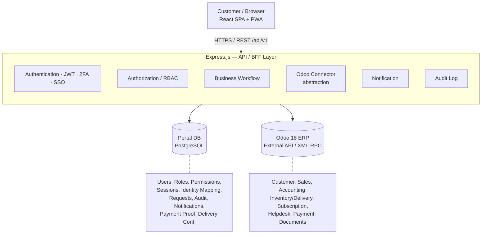
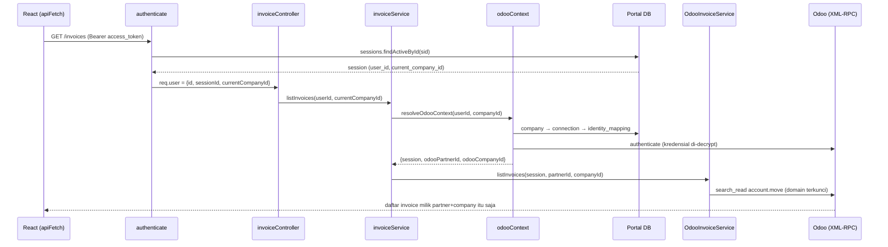
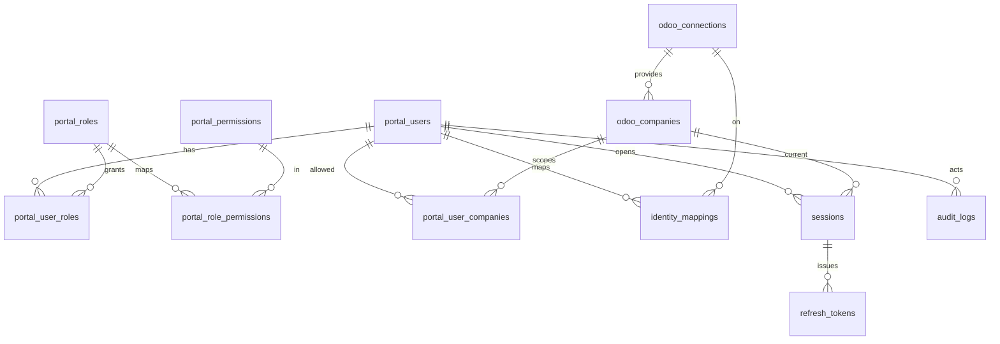

# System Documentation — Customer Self-Service Portal (CustPortalCRM)

> **Dokumen Teknis & Arsitektur (as-built)**
> Customer Self-Service Portal terintegrasi **Odoo 18**, dibangun sebagai
> *Custom Customer Portal Platform* (bukan modifikasi Odoo Portal).

Dokumen ini menggambarkan sistem **sebagaimana yang sudah diimplementasikan** di
repository ini. Untuk rasional desain, alternatif, dan keputusan arsitektur awal,
lihat [`Final_Technical_Specification.md`](Final_Technical_Specification.md). Nomor
`(section N)` di seluruh dokumen ini merujuk ke bagian pada spesifikasi tersebut.

**Prinsip inti:**

> *Custom Portal mengelola **siapa** customer di dalam portal dan **apa yang boleh**
> dia lakukan. Odoo mengelola **apa yang dimiliki** customer dan **transaksi apa**
> yang terjadi.*

---

## Daftar Isi

1. [Ringkasan Sistem](#1-ringkasan-sistem)
2. [Technology Stack](#2-technology-stack)
3. [Arsitektur High-Level](#3-arsitektur-high-level)
4. [Struktur Backend Berlapis](#4-struktur-backend-berlapis)
5. [Anatomi Sebuah Request (Data Flow)](#5-anatomi-sebuah-request-data-flow)
6. [Model Keamanan](#6-model-keamanan)
7. [Odoo Integration Layer](#7-odoo-integration-layer)
8. [Model Data (Portal Database)](#8-model-data-portal-database)
9. [Source of Truth](#9-source-of-truth)
10. [Permukaan API](#10-permukaan-api)
11. [Real-Time Notification](#11-real-time-notification)
12. [Arsitektur Frontend](#12-arsitektur-frontend)
13. [Multi-Company & Multi-Odoo](#13-multi-company--multi-odoo)
14. [Konfigurasi & Deployment](#14-konfigurasi--deployment)
15. [Build, Migrasi & Menjalankan](#15-build-migrasi--menjalankan)
16. [Status Fase Implementasi](#16-status-fase-implementasi)
17. [Batasan & Catatan Production Hardening](#17-batasan--catatan-production-hardening)

---

## 1. Ringkasan Sistem

Aplikasi memungkinkan customer melakukan aktivitas self-service (melihat quotation,
approve/reject, cek invoice & outstanding, bayar online, lacak pengiriman,
konfirmasi penerimaan, buat RMA/warranty/ticket, kelola user portal, dsb.) melalui
web browser (PWA), sementara **semua transaksi ERP tetap menjadi milik Odoo 18**.

Sistem terdiri dari tiga runtime:

| Runtime | Peran | Teknologi |
|---|---|---|
| **Frontend SPA** | Customer experience / UI | React 18 + Vite, PWA |
| **Backend API / BFF** | Identity, RBAC, workflow, Odoo adapter | Express.js (Node.js) |
| **Portal Database** | Domain data milik portal | PostgreSQL |
| **ERP (eksternal)** | System of Record | Odoo 18 via External API (XML-RPC) |

Backend adalah **satu-satunya** pihak yang memegang kredensial Odoo dan yang
melakukan otorisasi. Frontend tidak pernah menyimpan kredensial Odoo, password
database, maupun API key Odoo.

---

## 2. Technology Stack

### Backend (`/src`, `package.json`)

| Kategori | Pustaka | Fungsi |
|---|---|---|
| HTTP framework | `express` ^4.19 | Routing & middleware |
| Keamanan header | `helmet` ^7.1 | Secure HTTP headers |
| CORS | `cors` ^2.8 | Cross-origin, `credentials: true` |
| Database | `pg` ^8.12 | Driver PostgreSQL (connection pool) |
| Password hashing | `bcryptjs` ^2.4 | Hash password (cost 10) |
| Token | `jsonwebtoken` ^9.0 | Access token & token bertujuan khusus |
| 2FA | `otplib` ^12.0 | TOTP (Google Authenticator dsb.) |
| SSO | `google-auth-library` ^9.14 | OAuth2 Google Workspace |
| Odoo | `xmlrpc` ^1.3 | Odoo External API (XML-RPC) |
| Email | `nodemailer` ^9.0 | Reset password & notifikasi email |
| Upload | `multer` ^2.2 | Multipart (payment proof, signature POD) |
| Validasi | `zod` ^3.23 | Skema validasi request |
| Konfigurasi | `dotenv` ^16.4 | Env vars |
| Dev | `nodemon` ^3.1 | Hot reload |

### Frontend (`/frontend`, `frontend/package.json`)

| Kategori | Pustaka |
|---|---|
| UI library | `react` ^18.3 / `react-dom` |
| Routing | `react-router-dom` ^7 |
| Build tool | `vite` ^5.4 + `@vitejs/plugin-react` |
| PWA | Service worker + `manifest.webmanifest` (di `dist/`) |

> **Catatan:** Redis (cache/queue) disebut *optional* di spec dan **belum**
> digunakan. Notifikasi real-time dijalankan lewat polling ter-throttle, bukan
> queue (lihat [§11](#11-real-time-notification)).

---

## 3. Arsitektur High-Level



**Pembagian tanggung jawab:**

- **React** — UI/UX, dashboard, form/table, upload, e-signature (SignaturePad),
  notification UI, responsive/mobile. **Tidak** menyimpan kredensial apa pun.
- **Express** — central integration layer: auth, RBAC, session, 2FA, validasi,
  workflow, integrasi Odoo, orkestrasi payment, notifikasi, audit, otorisasi file.
- **PostgreSQL** — hanya data domain portal (bukan duplikasi database Odoo).
- **Odoo 18** — master untuk seluruh data & transaksi ERP.

---

## 4. Struktur Backend Berlapis

Backend memakai layering ketat. **Controller tidak pernah memanggil XML-RPC
langsung** — semua akses Odoo melewati service → Odoo connector.

```
Route → Middleware (authenticate / requirePermission) → Controller
      → Service (business logic + odooContext)
      → Repository (Portal DB)   ┐
      → Odoo*Service → OdooClient (XML-RPC) ┘
```

Pemetaan direktori (`src/`):

| Folder | Tanggung jawab | Contoh |
|---|---|---|
| `routes/` | Definisi endpoint & pemasangan middleware | `invoices.routes.js` |
| `middleware/` | Auth, permission, platform-admin, error handler | `authenticate.js`, `requirePermission.js` |
| `controllers/` | Parse request, panggil service, bentuk response | `invoiceController.js` |
| `services/` | Business logic; orkestrasi Odoo + Portal DB | `invoiceService.js` |
| `repositories/` | Query Portal DB (parameterized) | `sessionRepository.js` |
| `integrations/odoo/` | Adapter Odoo per-domain di atas `OdooClient` | `OdooInvoiceService.js` |
| `validators/` | Skema Zod per modul | `authValidators.js` |
| `config/` | Loader env tervalidasi | `env.js` |
| `db/` | Connection pool `pg` | `pool.js` |
| `utils/` | Crypto, ApiError, asyncHandler, fileStorage, dll. | `crypto.js` |

Domain yang tersedia (routes terpasang di `src/routes/index.js`, prefix `/api/v1`):

`auth`, `users`, `roles`, `permissions`, `companies`, `admin/odoo-connections`,
`audit-logs`, `dashboard`, `quotations`, `orders`, `invoices`, `deliveries`,
`requests`, `notifications`, `products`, `tickets`, `rma`, `warranty`,
`subscriptions`, `analytics`.

---

## 5. Anatomi Sebuah Request (Data Flow)

Contoh: `GET /api/v1/invoices` ("invoice saya").



Titik penting keamanan (section 22): request `GET /invoices/999` **tidak** langsung
diteruskan ke Odoo. Backend selalu menurunkan identitas dari **session**, bukan dari
apa pun yang dikirim client:

`Session → Portal User → Identity Mapping → Odoo Partner → Company → Permission → domain filter Odoo`

`odooContext.js` menyediakan dua fungsi:

- `resolveIdentity(userId, companyId)` — memetakan user+company aktif ke triple
  `{connection, odooPartnerId, odooCompanyId}` **tanpa** memanggil Odoo (dipakai
  saat hanya butuh tahu *connection/partner* mana, mis. menstempel record lokal).
- `resolveOdooContext(userId, companyId)` — seperti di atas **plus** membuka session
  Odoo ter-autentikasi, dipakai setiap read/aksi yang benar-benar menyentuh Odoo.

---

## 6. Model Keamanan

### 6.1 Autentikasi

Login berbasis **JWT access token + opaque refresh token**, dengan session
server-side yang dapat dicabut.

- **Access token** — JWT ditandatangani `JWT_SECRET`, klaim `{sub, sid, purpose:'access'}`,
  TTL pendek (default `15m`). Setiap request tervalidasi di `authenticate.js`: bukan
  hanya signature JWT, tetapi **session di belakang `sid` harus masih aktif** →
  logout & rotasi refresh dapat mencabut akses seketika.
- **Refresh token** — random 48-byte, **hanya hash SHA-256-nya** yang disimpan di
  `refresh_tokens`. Saat `/auth/refresh`: token lama dirotasi (`rotated`) dan token
  baru diterbitkan (rotation dengan jejak `rotated_to_id`). TTL default `30` hari.
- **Brute-force guard** — `failed_login_attempts` di-increment; setelah **5** gagal
  akun dikunci **15 menit** (`locked_until`). Login sukses mereset state ini.
- **Password** — hash `bcrypt` (cost 10). Plaintext tidak pernah disimpan
  (schema: `password_hash TEXT NOT NULL`).
- **Reset password** — token JWT bertujuan `password_reset` (TTL 30m) dikirim via
  email. `/auth/password/forgot` selalu balas **202** baik email terdaftar maupun
  tidak (tidak membocorkan keberadaan akun).

### 6.2 Two-Factor Authentication (2FA)

TOTP via `otplib`. Secret disimpan **terenkripsi** (`two_factor_secret`).

- **Enable** (`POST /auth/2fa/enable`, terautentikasi) → membuat secret + `otpauth_url`
  untuk QR.
- **Verify** (`POST /auth/2fa/verify`) melayani dua peran (via `optionalAuthenticate`):
  - **Enrollment confirm** (terautentikasi) → set `two_factor_enabled=true` lalu
    menerbitkan session baru.
  - **Login challenge** (anonim) → memakai `challenge_token` (JWT `purpose:'2fa_challenge'`,
    TTL 5m) yang diberikan saat login jika 2FA aktif.

### 6.3 Single Sign-On (Google Workspace) — Phase 7

Alur *redirect-based* OAuth2 dijembatani ke SPA lewat **kode exchange sekali-pakai**
(`ssoService.js`):

1. `GET /auth/sso/google/start` → redirect ke Google (state = JWT `sso_state`, TTL 5m).
2. `GET /auth/sso/google/callback` → tukar code, verifikasi **signature + audience**
   ID token, cek `email_verified`, opsional cek `hd` (workspace domain). **Tidak**
   menerbitkan session di sini; menyimpan `code` opaque in-memory (TTL 60s).
3. `POST /auth/sso/exchange` → SPA menukar `code` menjadi session nyata (`loginWithSso`).

SSO mencocokkan **portal_user yang sudah ada** berdasarkan email — ini federasi
identitas, **bukan** jalur signup. SSO men-*skip* password & 2FA karena IdP dianggap
sudah membuktikan kepemilikan email terverifikasi.

> Jika `GOOGLE_CLIENT_ID/SECRET/REDIRECT_URI` tidak diset, `/start` mengembalikan
> `503 sso_not_configured`.

### 6.4 Otorisasi / RBAC

`requirePermission(code)` middleware:

- **Platform admin** (`is_platform_admin = true`) mem-*bypass* seluruh RBAC per-customer
  (analog superuser) — supaya deployment baru tidak butuh bootstrap role assignment.
  Platform admin dibuat via `npm run create-platform-admin`.
- Selain itu, permission user (union dari role-nya) harus mengandung `code`, kalau
  tidak → `403 forbidden: Missing permission: <code>`.

Endpoint admin platform (mis. `admin/odoo-connections`) digerbang
`requirePlatformAdmin`.

**Prinsip:** otorisasi **wajib** di Express — permission di frontend hanya kosmetik
(section 34, risk #5). Model RBAC: `portal_users → portal_user_roles → portal_roles
→ portal_role_permissions → portal_permissions`.

### 6.5 Isolasi Data (Record Ownership)

Setiap Odoo*Service membangun **base domain** yang mengunci query ke partner +
company hasil resolusi session — bukan parameter dari client. Contoh
`OdooInvoiceService`:

```js
function baseDomain(partnerId, companyId) {
  return [
    ['partner_id', '=', partnerId],
    ['company_id', '=', companyId],
    ['move_type', '=', 'out_invoice'],
    ['state', '=', 'posted'],
  ];
}
```

Mengambil satu invoice = base domain **+** `['id','=',invoiceId]`. Jika record bukan
milik partner/company tersebut, hasilnya kosong → `404 not_found`. Dengan begitu
IDOR (mis. menebak `id` orang lain) secara struktural tidak mungkin.

### 6.6 Enkripsi & Secret (`utils/crypto.js`)

- **AES-256-GCM** untuk data-at-rest sensitif: kredensial/API key Odoo
  (`encrypted_credential`) dan secret 2FA. Format: `base64(iv[12] ‖ authTag[16] ‖ ciphertext)`.
  Kunci dari `ENCRYPTION_KEY` (wajib **32-byte = 64 hex chars**), `encryption_key_version`
  disiapkan untuk rotasi kunci.
- **SHA-256** untuk hash refresh token & one-way lookup.
- `randomToken()` — `crypto.randomBytes` untuk refresh token & kode SSO.

### 6.7 Ringkasan Kontrol Keamanan

| Kontrol | Status | Catatan |
|---|---|---|
| HTTPS | ⛅ Deployment | Diterminasi di Nginx/Cloudflare (reverse proxy) |
| JWT + session revocable | ✅ | `authenticate.js` |
| RBAC | ✅ | `requirePermission`, platform-admin bypass |
| 2FA (TOTP) | ✅ | `otplib`, secret terenkripsi |
| SSO (Google) | ✅ | Opsional, per-config |
| Input validation | ✅ | Zod validators per modul |
| SQL injection | ✅ | Query `pg` parameterized |
| CORS | ✅ | `helmet` + `cors({credentials:true})` |
| Kredensial terenkripsi | ✅ | AES-256-GCM |
| Record ownership | ✅ | Domain terkunci partner+company |
| Audit log | ✅ | Append-only `audit_logs` |
| Rate limiting | ❌ | **Belum** ada middleware (lihat [§17](#17-batasan--catatan-production-hardening)) |
| CSRF | N/A | Bearer token di header, bukan cookie |

---

## 7. Odoo Integration Layer

Semua akses Odoo diabstraksi berlapis sehingga *upgrade Odoo hanya menyentuh satu
file* (`OdooClient`, section 34 risk #7).

```
Service domain  →  Odoo<Domain>Service  →  OdooClient (XML-RPC)  →  Odoo
```

### `OdooClient` (`integrations/odoo/OdooClient.js`)

Wrapper tipis atas **XML-RPC External API** Odoo (endpoint `/xmlrpc/2/common` &
`/xmlrpc/2/object`):

| Method | Padanan Odoo |
|---|---|
| `version()` | `common.version()` — cek server |
| `authenticate(user, cred)` | `common.authenticate(...)` → `uid` |
| `execute(...)` | `object.execute_kw(...)` |
| `searchRead / read / create / write` | operasi model umum |
| `callMethod(model, method, ids, ...)` | method record (`action_confirm`, `message_post`, dll.) |
| `readGroup(...)` | `read_group` (agregasi server-side untuk analytics) |

Error dinormalkan ke `ApiError` (mis. `422 odoo_unreachable`, `422 odoo_auth_failed`,
`502 odoo_call_failed`).

Dua yang pertama **tidak** sampai ke pelanggan apa adanya. Sejak
[CR-045](cr.md#cr-045--permintaan-pelanggan-sungguhan-jadi-health-check-koneksi-odoo-dan-tolak-koneksi-duplikat),
`odooContext` menerjemahkannya jadi `503 odoo_connection_unavailable` untuk setiap endpoint
pelanggan sekaligus mencatat hasilnya ke `odoo_connections.status`/`last_error`
(`src/services/odooConnectionHealth.js`) — pesan mentahnya ditulis untuk admin yang baru
mengetik kredensial, dan hanya endpoint admin (`check-connection`/`test-connection`/`POST /`/
`PATCH /:id`) yang masih memakainya. `502 odoo_call_failed` sengaja **tidak** ikut: itu bug
kode atau modul Odoo yang tidak terpasang, bukan kesehatan koneksi.

Modul Odoo yang tidak terpasang punya penanganannya sendiri sejak
[CR-046](cr.md#cr-046--deteksi-modul-odoo-saat-runtime-fitur-yang-tidak-didukung-odoo-tujuan-ditolak-dengan-jelas-bukan-lewat-fault-xml-rpc):
`src/services/odooCapabilityService.js` membaca registry Odoo sendiri (`ir.model` +
`ir.model.fields`, cache per koneksi 10 menit) untuk mengetahui apakah Helpdesk,
Maintenance, addon `installed_base`, dan Subscriptions benar-benar ada. Gerbangnya di
`resolveOdooContext(userId, companyId, { feature })`, jawabannya `503 feature_unavailable`,
dan `GET /capabilities` mengekspos peta yang sama ke SPA supaya menu yang tidak akan bisa
bekerja disembunyikan sejak awal alih-alih gagal saat diklik.

### Odoo Services yang tersedia

`OdooAuthService`, `OdooPartnerService`, `OdooCompanyService`, `OdooSalesService`,
`OdooInvoiceService`, `OdooPaymentService`, `OdooDeliveryService`,
`OdooHelpdeskService`, `OdooWarrantyService`, `OdooSubscriptionService`,
`OdooProductService`, `OdooAnalyticsService`, `OdooAttachmentService`,
`OdooEquipmentService` (Customer Population / Installed Base, lihat bullet di bawah).

**Odoo Connection Management** (section 9, alur sejak [CR-044](cr.md#cr-044--validasi-kredensial-odoo-sebelum-disimpan-wizard-check-connection--pilih-company--simpan)):
admin memasukkan URL → Username → Password/API Key → *Check Connection* →
*Validate* (`version()` → deteksi database → `authenticate()`) → *Get Companies* →
*Select Company* → *Save Configuration*. Nama database **tidak ditanyakan**: dibaca dari
service `db` XML-RPC Odoo, dan baru diminta ke admin kalau server melayani beberapa
database atau menolak melistnya (`list_db = False`). Validasi terjadi **sebelum** apa pun
disimpan (`POST /admin/odoo-connections/check-connection`), dan `POST /`/`PATCH /:id`
memverifikasi ulang sendiri — tidak ada baris `odoo_connections` yang belum pernah
terbukti bekerja, jadi baris baru lahir `status = 'connected'` (bukan `'pending'`) dan
koneksi baru tidak bisa disimpan saat Odoo-nya tidak terjangkau. Kredensial disimpan
terenkripsi; status koneksi (`pending/connected/error/disabled`), `odoo_version`,
`last_checked_at`, `last_error` dicatat pada `odoo_connections`. Company yang tidak
dipilih tetap tersimpan di `odoo_companies` dengan `is_active = false` — dipakai hanya
untuk menentukan company default saat provisioning user, bukan untuk mencabut akses.

**Contoh detail integrasi** (didokumentasikan di kode):

- **Invoice PDF** — mengunduh attachment PDF terakhir dari `account.move` (Odoo
  auto-attach saat posted/sent) daripada me-render report via XML-RPC yang rapuh
  antar-versi.
- **Delivery confirmation** — POD di-*push* ke Odoo sebagai chatter note/attachment
  pada `stock.picking`; record lokal (`delivery_confirmations`) menjadi cadangan bila
  push gagal separuh jalan.
- **RMA / Warranty** — tidak punya model Odoo sendiri (butuh custom addon, out of
  reach di sini); tiap klaim di-*mirror* ke `helpdesk.ticket` dan **status dibaca
  live** dari stage ticket (tidak pernah di-cache lokal → tak pernah basi).
- **Customer Population / Installed Base** (`OdooEquipmentService`, spec:
  [`Docs/CR/customer_population_installed_base.md`](Docs/CR/customer_population_installed_base.md)) —
  registry mesin pelanggan hidup **sepenuhnya di Odoo** (`maintenance.equipment`,
  `product.template`), portal tidak menyimpan salinannya (D-2/IB-3). Dua jebakan yang
  mendasari desainnya:
  - `maintenance.equipment.partner_id` bawaan berlabel **"Vendor"** (pemasok alat), bukan
    pelanggan pemilik — kepemilikan disimpan di field `customer_id` terpisah.
  - Field custom (`customer_id`, `parent_equipment_id`, `catalog_product_id`, dst.) berasal
    dari **addon Odoo `installed_base`** (Python asli, bukan Odoo Studio) yang dideploy ke
    target Odoo — bukan skema portabel yang dijamin ada di instance lain. Jalankan
    `node scripts/check-equipment-capability.js` (IB-5) sebelum memercayai field mana pun.
  - Query dikunci ke **keluarga partner** (`commercial_partner_id`, lewat
    `OdooPartnerService.findFamilyIdsViaSession`), bukan partner persis — unit fisik ada di
    alamat pengiriman (partner anak), bukan di partner induk tempat user portal ter-map (D-4).
  - Mesin rekomendasi jatuh-tempo-servis (`equipmentService.getDueReplacements`) deterministik
    (bukan ML) dan wajib menyertakan `basis` + `attribution` di setiap baris — pembelian yang
    tidak bisa ditautkan ke satu unit spesifik (pelanggan punya beberapa unit model sama)
    diberi label `fleet_estimated`, tidak pernah ditebak sebagai `unit` (D-5/IB-4).

---

## 8. Model Data (Portal Database)

Skema dikelola sebagai migrasi SQL versioned di `database/migrations/`, diterapkan
per-fase, transaksional, dengan tabel penanda `schema_migrations` (lihat
`scripts/migrate.js`). Fungsi trigger `set_updated_at()` menjaga kolom `updated_at`.
Extension `pgcrypto` dipakai untuk `gen_random_uuid()`.

> **Aturan:** *Jangan* menduplikasi tabel Odoo (tidak ada `portal_invoices`,
> `portal_sales_orders`, dll.). Hanya data domain portal yang disimpan.

### Peta tabel per fase

| Migrasi | Tabel | Fungsi |
|---|---|---|
| `0001` Foundation | `odoo_connections` | Koneksi Odoo + kredensial terenkripsi |
| | `odoo_companies` | `res.company` per koneksi |
| | `portal_roles`, `portal_permissions`, `portal_role_permissions` | RBAC |
| | `portal_users` | Identity portal (hash password, status, 2FA, platform-admin, lock) |
| | `portal_user_roles` | User ↔ Role |
| | `portal_user_companies` | Company yang boleh di-switch (satu default) |
| | `identity_mappings` | Portal user ↔ `res.partner` per koneksi (+`odoo_user_id`) |
| | `sessions` | Session server-side (+`current_company_id`) |
| | `refresh_tokens` | Hash refresh token + rotation |
| | `audit_logs` | Append-only (`BIGSERIAL`), high write |
| `0002` Core Portal | `customer_requests` | Request Product / Request Quotation (JSONB payload) |
| | `notifications` | Feed notifikasi in-app |
| `0003` Payment | `payment_proofs` | Bukti transfer manual (file, amount, status verifikasi) |
| `0004` Fulfillment | `delivery_confirmations` | POD/konfirmasi terima (+`odoo_synced_at`) |
| `0005` RMA/Warranty | `rma_requests` | RMA → tautan `helpdesk.ticket` (refund/replacement) |
| | `warranty_claims` | Klaim garansi → tautan `helpdesk.ticket` (serial number) |
| `0006` Realtime | `identity_mappings.last_polled_at` | Cursor throttle poll perubahan Odoo |
| `0007` Webhook | `odoo_connections.webhook_secret` | Secret provisioning user dari Odoo (di URL path, bukan header) |
| `0008` OTP login | `login_otps` | Login passwordless via email OTP |
| `0009` Doc share | `document_shares` | Berbagi dokumen staff → customer (scoped per partner+connection) |
| `0010` Asisten | `assistant_settings` | Provider/model/kuota per connection; API key terenkripsi. NULL connection = default global |
| | `assistant_prompts` | Prompt berversi per `(key, locale)`; satu versi aktif, rollback = aktifkan versi lama |
| | `assistant_tools` | Override aktif/mati + permission per tool. Baris opsional — tool tanpa baris tetap aktif |
| | `assistant_conversations` | Percakapan, scoped `(portal_user_id, odoo_connection_id)` |
| | `assistant_messages` | Pesan + jejak tool. Menyimpan ringkasan + ref record, **bukan** payload Odoo mentah |
| | `assistant_action_drafts` | Draf aksi tulis (dipakai Fase 2; tabelnya sudah ada) |
| | `assistant_feedback` | 👍/👎 per pesan (satu penilaian per pesan) |
| `0011` Equipment corrections | `equipment_corrections` | Antrean permintaan koreksi data installed base → tautan `helpdesk.ticket` (pola stopgap sama seperti `rma_requests`/`warranty_claims`). **Bukan** salinan registry — registry-nya sendiri sepenuhnya di Odoo, tidak pernah di-cache di sini (D-2/IB-3) |

### Relasi inti



### Seeds (RBAC awal)

`database/seeds/` mengisi katalog permission & role default (per-fase agar konsisten
dengan modul yang benar-benar ada):

- **Roles**: `Customer Admin`, `Finance`, `Procurement`, `Viewer`.
- Contoh permission: `user.view`, `user.create`, `user.disable`, dan permission modul
  lain (helpdesk, RMA/warranty, subscription) ditambahkan di seed fase terkait.
- `Customer Admin` adalah satu-satunya role Phase 1 dengan hak user-management.

---

## 9. Source of Truth

| Data | Master |
|---|---|
| Portal User, Password, Role, Permission, Session, Audit login | **Portal** |
| Customer, Company, Product, Price/Pricelist | **Odoo** |
| Quotation, Sales Order, Invoice, Payment | **Odoo** |
| Stock, Delivery, Subscription, Helpdesk | **Odoo** |
| RMA, Warranty | **Odoo (helpdesk.ticket) + Portal** (metadata lokal, status live dari ticket) |
| Installed Base (mesin pelanggan), Service Catalog (interval/kompatibilitas/supersession part) | **Odoo** (addon `installed_base`) — portal tidak menyimpan salinan apa pun (D-2/IB-3) |
| Equipment correction requests | **Odoo (helpdesk.ticket) + Portal** (metadata lokal, status live dari ticket) — pola sama seperti RMA/Warranty |
| Payment proof, Delivery confirmation, Customer request, Notification | **Portal** |

---

## 10. Permukaan API

Semua endpoint di-prefix **`/api/v1`**. Kontrak lengkap tersedia di
[`api/openapi.yaml`](api/openapi.yaml). Health check non-versioned: `GET /health`.

Format error konsisten: `{ "error": { "code": "...", "message": "..." } }`
(`middleware/errorHandler.js`).

### Authentication (`/auth`)

| Method | Path | Auth | Fungsi |
|---|---|---|---|
| POST | `/auth/login` | — | Login (bisa balas `requires_2fa` + `challenge_token`) |
| POST | `/auth/logout` | Bearer | Cabut session + refresh token |
| POST | `/auth/refresh` | — | Rotasi refresh → access baru |
| POST | `/auth/2fa/enable` | Bearer | Mulai enrollment TOTP |
| POST | `/auth/2fa/verify` | Opsional | Konfirmasi enroll / jawab challenge login |
| POST | `/auth/password/change` | Bearer | Ganti password |
| POST | `/auth/password/forgot` | — | Kirim link reset (selalu 202) |
| POST | `/auth/password/reset` | — | Set password baru via token |
| GET | `/auth/sso/google/start` | — | Redirect ke Google |
| GET | `/auth/sso/google/callback` | — | Callback OAuth → kode exchange |
| POST | `/auth/sso/exchange` | — | Tukar kode → session |

### Modul lain (ringkas)

| Prefix | Cakupan |
|---|---|
| `/users`, `/roles`, `/permissions` | User management & RBAC |
| `/companies` | List, `current`, `switch` (multi-company) |
| `/admin/odoo-connections` | CRUD koneksi Odoo (platform-admin) |
| `/audit-logs` | Query audit |
| `/dashboard` | Ringkasan (counts, outstanding, recent activity) |
| `/quotations` | List/detail, `approve`, `reject`, e-sign |
| `/orders` | Sales order, tracking, reorder |
| `/invoices` | List/detail, `pdf`, outstanding, `pay`, payment-proof |
| `/deliveries` | List/detail, tracking, `confirm` (POD) |
| `/requests` | Request product / request quotation |
| `/products` | Katalog, harga customer, availability |
| `/tickets` | Helpdesk (create, reply, attachment, status) |
| `/rma`, `/warranty` | After-sales (mirror ke helpdesk.ticket) |
| `/equipment` | "My Equipment" (installed base): registry, part jatuh tempo, riwayat servis, permintaan koreksi (mirror ke helpdesk.ticket) |
| `/subscriptions` | Kontrak/langganan (read-through Odoo) |
| `/analytics` | Agregasi via Odoo `read_group` |
| `/notifications` | Feed in-app; polling memicu cek perubahan Odoo |
| `/assistant` | AI Assistant: `config`, `chat` (**SSE**), `conversations`, feedback |
| `/admin/assistant` | Settings, versi prompt, aktif/mati tool (platform-admin) |

---

## 11. Real-Time Notification

Dua jalur (section 21 & 29):

1. **Push sinkron** — `notificationService.notify()` dipanggil langsung oleh service
   lain segera setelah aksi portal sukses (mis. "quotation approved").
2. **Change-detection ter-throttle** — `checkForUpdates()` dipicu oleh polling
   frontend `GET /notifications` (interval 30–60s). Tiap poll melakukan *bounded read*
   "apa yang berubah sejak terakhir" menggunakan cursor `identity_mappings.last_polled_at`,
   di-throttle minimum **30 detik** per user+connection agar tidak menghajar Odoo.

Yang dideteksi: `account.move` (invoice `paid`), `stock.picking` outgoing (`done`),
`helpdesk.ticket` (ada `write_date` baru) → masing-masing membuat notifikasi
(`invoice.paid`, `delivery.delivered`, `ticket.updated`). Pola ini *best-effort*: bila
Odoo tak terjangkau, poll diam-diam dilewati (bukan hard dependency).

> Ini adalah tahap awal sesuai spec. Untuk skala produksi, arsitektur target adalah
> Odoo webhook → queue → WebSocket (belum diimplementasikan).

---

## 12. Arsitektur Frontend

SPA React (`frontend/src`) dengan routing berbasis `react-router-dom`.

- **`App.jsx`** — router; `ProtectedRoute` menahan route privat sampai status auth
  `authenticated`. Rute publik: `/login`, `/forgot-password`, `/reset-password`,
  `/2fa`, `/sso/callback`. Rute privat bersarang di `AppShell`.
- **`api/client.js`** — inti komunikasi. Menyimpan state auth in-memory
  (`accessToken`, `user`) + refresh token di `localStorage`. `apiFetch()` melampirkan
  Bearer dan pada **401** mencoba **satu** silent refresh-and-retry sebelum memaksa
  balik ke `/login`. Varian `apiFetchForm` (multipart upload) & `apiFetchBlob`
  (download PDF/attachment) memakai kontrak refresh yang sama.
- **`context/AuthContext.jsx`** — membungkus state auth ke React context; `bootstrapSession()`
  memulihkan session dari refresh token saat load.
- **`api/*.js`** — modul per-domain (invoices, orders, quotations, tickets, dst.).
- **`pages/*.jsx`** — satu halaman per fitur (Dashboard, Users, Security, Quotations,
  Orders, Invoices, Deliveries, Requests, Products, Tickets, RMA, Warranty,
  Subscriptions, Analytics, + auth pages).
- **`components/`** — `AppShell` (sidebar + topbar), `CompanySwitcher`,
  `NotificationBell`, `SignaturePad` (e-sign POD), `BarChart` (analytics).

**Navigasi** (`AppShell.jsx`) mencerminkan menu section 31. Item yang **belum** punya
API di-render *disabled* dengan badge (mis. "Service Request — Needs a custom Odoo
module") sehingga information architecture terlihat tanpa memalsukan fitur yang belum ada.

**PWA** — hasil build (`frontend/dist`) menyertakan `sw.js`, `manifest.webmanifest`,
dan `icon.svg` untuk instalasi mobile/offline shell.

---

## 13. Multi-Company & Multi-Odoo

- **Multi-company** — `portal_user_companies` menentukan company yang boleh diakses
  user; satu `is_default`. Session menyimpan `current_company_id`; `POST /companies/switch`
  menggantinya. **Semua** query Odoo ter-scope ke company aktif (via base domain).
- **Multi-Odoo** — didukung *by design*: `identity_mappings` memisahkan pemetaan
  partner per `odoo_connection_id`, sehingga menambah instans Odoo kedua adalah
  **perubahan data, bukan migrasi skema**. Satu portal dapat menghadap banyak Odoo
  (mis. Indonesia / Singapore / Malaysia).

---

## 14. Konfigurasi & Deployment

### Environment variables backend (`.env`, lihat `.env.example` & `config/env.js`)

| Var | Wajib | Default | Keterangan |
|---|---|---|---|
| `PORT` | — | `3000` | Port API |
| `DATABASE_URL` | ✅ | — | Koneksi PostgreSQL |
| `JWT_SECRET` | ✅ | — | Kunci tanda tangan JWT (string acak panjang) |
| `ACCESS_TOKEN_TTL` | — | `15m` | Umur access token |
| `REFRESH_TOKEN_TTL_DAYS` | — | `30` | Umur refresh token (hari) |
| `ENCRYPTION_KEY` | ✅ | — | **64 hex chars (32 byte)** untuk AES-256-GCM |
| `CORS_ORIGIN` | — | `*` | Origin frontend |
| `APP_BASE_URL` | — | `http://localhost:5173` | Basis link email (reset password) |
| `SMTP_*` | — | — | SMTP; jika `SMTP_HOST` kosong, email dicetak ke log |
| `GOOGLE_CLIENT_ID/SECRET/REDIRECT_URI` | — | — | SSO; kosong → SSO nonaktif |
| `GOOGLE_WORKSPACE_HD` | — | — | Batasi SSO ke satu domain Workspace |
| `OTP_*` | — | lihat `.env.example` | Login passwordless via email OTP |
| `ASSISTANT_ENABLED` | — | `false` | Sakelar asisten. **Baris `assistant_settings` menimpanya** |
| `ASSISTANT_PROVIDER` | — | `ollama` | `ollama` \| `gemini` \| `claude` |
| `ASSISTANT_BASE_URL` | — | `http://localhost:11434` | Endpoint provider (dipakai `ollama`) |
| `ASSISTANT_API_KEY` | — | — | Wajib untuk `gemini`/`claude`. Per-connection disimpan terenkripsi di DB |
| `ASSISTANT_MODEL` | — | `qwen3:8b` | Nama model |
| `ASSISTANT_TIMEOUT_MS` | — | `30000` | Timeout provider. **Hanya dari env** — bukan setelan per-company |
| `ASSISTANT_TEMPERATURE`, `ASSISTANT_MAX_OUTPUT_TOKENS`, `ASSISTANT_MAX_TOOL_ITERATIONS`, `ASSISTANT_HISTORY_WINDOW`, `ASSISTANT_DAILY_MESSAGE_QUOTA`, `ASSISTANT_BURST_PER_MINUTE`, `ASSISTANT_DEFAULT_LOCALE` | — | lihat `.env.example` | Lapis terakhir untuk knob yang punya kolom di `assistant_settings` |

Frontend memakai `VITE_API_BASE_URL` (default `/api/v1`, relatif ke host yang menyajikan SPA).

**Presedensi konfigurasi asisten** (`services/assistantConfigService.js`):

```
assistant_settings (odoo_connection_id = aktif)
  -> assistant_settings (global, odoo_connection_id IS NULL)
    -> env.assistant
      -> ApiError(503, 'assistant_not_configured')
```

Hasilnya di-cache per connection (TTL 60 detik, di-invalidasi eksplisit saat admin menyimpan).
Tidak ada literal sebagai fallback terakhir di dalam JS: kalau tidak ada satu pun lapis yang
menyediakan nilai wajib, fitur mati dengan 503 yang menyebut nama field-nya. Konsekuensi
operasional yang mudah terlewat: karena DB menimpa env, `ASSISTANT_ENABLED=false` **tidak**
mematikan asisten kalau ada baris `assistant_settings` dengan `enabled = true`.

Prompt SENGAJA tidak ikut di-cache (`assistant/promptBuilder.js`) — perubahan prompt harus
berlaku pada pesan berikutnya, bukan setelah TTL habis.

### Topologi deployment (rekomendasi)

```
Cloudflare / Nginx (TLS, reverse proxy)
   ├── / (static)      → React build (frontend/dist)
   └── /api/v1         → Express (Node)
                         ├── PostgreSQL (Portal DB)
                         └── Odoo 18 (XML-RPC, jaringan privat)
```

Docker direkomendasikan (section 35). File upload (payment proof, signature) saat ini
disimpan ke **disk lokal** (`uploads/`) — ganti ke object storage sebelum produksi
(lihat [§17](#17-batasan--catatan-production-hardening)).

> **Prasyarat Odoo:** External API Odoo 18 hanya tersedia pada plan **Custom**
> (bukan One App Free/Standard) — section 34 risk #1.

---

## 15. Build, Migrasi & Menjalankan

### Backend

```bash
npm install
cp .env.example .env    # lalu isi DATABASE_URL, JWT_SECRET, ENCRYPTION_KEY
npm run migrate         # menerapkan database/migrations + database/seeds
npm run create-platform-admin
npm run dev             # nodemon; atau `npm start` untuk produksi
```

`npm run migrate` (`scripts/migrate.js`) memindai `database/migrations/` lalu
`database/seeds/` secara berurutan (nama file), menerapkan yang belum tercatat di
`schema_migrations`, masing-masing dalam transaksi (rollback bila gagal). Migrasi
bersifat *idempotent* di level runner.

### Frontend

```bash
cd frontend
npm install
cp .env.example .env    # set VITE_API_BASE_URL bila perlu
npm run dev             # Vite dev server (default :5173)
npm run build           # output ke frontend/dist (PWA)
```

---

## 16. Status Fase Implementasi

| Fase | Cakupan | Status |
|---|---|---|
| **1 — Foundation** | Auth, User Mgmt, RBAC, Odoo Connection/Connector, Customer Mapping, Company Selection, Audit Log | ✅ Implemented |
| **2 — Core Portal** | Dashboard, Profile, Quotation, Sales Order, Invoice, Document, Notification | ✅ Implemented |
| **3 — Payment** | Online Payment (Odoo), Payment Status, Outstanding, Payment Proof | ✅ Implemented |
| **4 — Fulfillment** | Delivery Order, Tracking, Status, POD, Delivery Confirmation | ✅ Implemented |
| **5 — After Sales** | Helpdesk, Complaint, RMA, Warranty | ✅ Implemented (RMA/Warranty *stopgap* via helpdesk.ticket) |
| **6 — Contract** | Subscription (read-through Odoo) | ✅ Implemented |
| **7 — Advanced** | Real-time Notification (polling), Analytics, SSO, PWA | ✅ Sebagian (Multi-Odoo *by design*; WebSocket/queue belum) |

---

## 17. Batasan & Catatan Production Hardening

Item nyata yang tercermin di kode/komentar dan perlu dibereskan sebelum produksi:

1. **File storage lokal** — `payment_proofs.file_path` & `delivery_confirmations.signature_file_path`
   menunjuk disk lokal (`uploads/`). Pindahkan ke object storage (S3/Odoo Documents)
   agar tahan multi-instance & durable.
2. **State in-memory** — peta exchange SSO (`ssoService`) dan throttle poller bersifat
   in-memory: tidak selamat dari restart / instans kedua di belakang load balancer.
   Pindahkan ke Postgres (TTL index) bila di-scale horizontal.
3. **Rate limiting belum ada** — `app.js` hanya memakai `helmet`, `cors`, `express.json`.
   Tambahkan rate limiter (mis. per-IP pada `/auth/*`) sesuai section 22/34. Dua endpoint
   sudah membawa pembatasnya sendiri secara lokal (in-memory, per-proses, tidak akurat kalau
   backend diskalakan multi-instance): `/assistant/chat` (`assistantRateLimiter`) dan
   `/equipment/due-replacements` (`equipmentRateLimiter`) — keduanya endpoint termahal di
   fiturnya masing-masing — plus, sejak CR-044, ketiga endpoint konfigurasi koneksi Odoo yang
   benar-benar menelepon Odoo (`admin/odoo-connections` check-connection/create/patch) lewat
   `odooConnectionRateLimiter`.
4. **bcrypt cost 10 / tidak Argon2id** — spec menyebut Argon2id/bcrypt; implementasi
   memakai bcrypt cost 10. Naikkan cost atau migrasi ke Argon2id untuk profil keamanan
   lebih tinggi.
5. **Refresh token di `localStorage`** — memudahkan silent refresh namun terekspos
   XSS. Pertimbangkan cookie `HttpOnly`/`SameSite` bila model ancaman menuntut.
6. **Real-time via polling** — arsitektur target (Odoo webhook → queue → WebSocket)
   belum dibangun; polling ter-throttle adalah tahap awal.
7. **Redis (cache/queue)** — masih *optional* dan belum dipakai; pertimbangkan untuk
   caching read Odoo yang mahal (section 34 risk #2) & agregasi dashboard.
8. **RMA/Warranty stopgap** — idealnya custom Odoo addon (`portal_rma`, `portal_warranty`,
   section 27). Saat ini di-*mirror* ke `helpdesk.ticket`.

---

*Dokumen ini menggambarkan kondisi as-built repository. Perubahan arsitektur besar
sebaiknya diperbarui di sini bersamaan dengan perubahan kode.*
